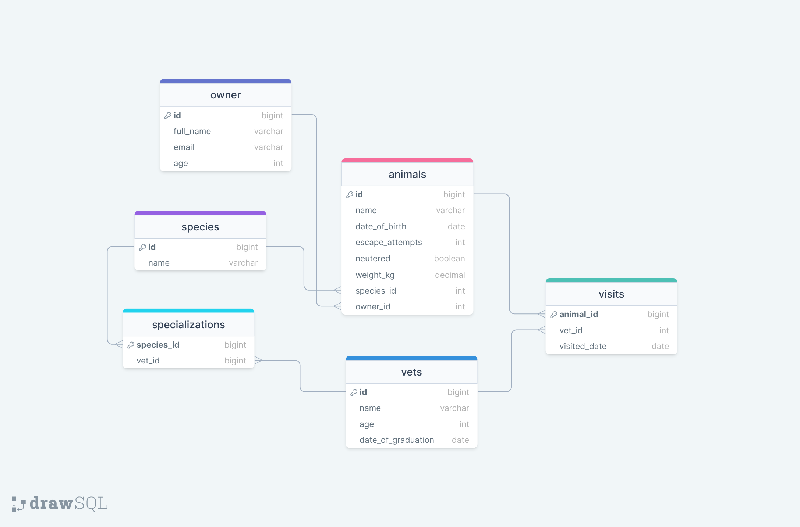

# 📗 Table of Contents

- [📖 About the Project](#about-project)
  - [🛠 Built With](#built-with)
    - [Tech Stack](#tech-stack)
    - [Key Features](#key-features)
  - [🚀 Live Demo](#live-demo)
- [💻 Getting Started](#getting-started)
  - [Setup](#setup)
  - [Prerequisites](#prerequisites)
  - [Install](#install)
  - [Usage](#usage)
  - [Run tests](#run-tests)
  - [Deployment](#triangular_flag_on_post-deployment)
- [👥 Authors](#authors)
- [🔭 Future Features](#future-features)
- [🤝 Contributing](#contributing)
- [⭐️ Show your support](#support)
- [🙏 Acknowledgements](#acknowledgements)
- [❓ FAQ](#faq)
- [📝 License](#license)


# 📖 Vet Clinic Database <a name="about-project"></a>

**Vet Clinic Database**, a relational database project. User can use query to create, read, update and delete specific data form the database using sql terminal.

## 🛠 Built With <a name="built-with"></a>

### Tech Stack <a name="tech-stack"></a>
<summary>Database</summary>
  <ul>
    <li><a href="https://reactjs.org/">PostgreSQL</a></li>
  </ul>

### Database Diagram 
<div >
  
  
  <br/>
</div>


### Key Features <a name="key-features"></a>

- **Users can create database table using this project.**
- **User can insert and update database table column.**
- **User can get specific data with different sql query**

<p align="right">(<a href="#readme-top">back to top</a>)</p>


## 💻 Getting Started <a name="getting-started"></a>

This repository includes files with plain SQL that can be used to recreate a database:
- At first Clone this repository to your desired folder:

```sh
  cd my-folder
  git clone https://github.com/george827/Vet-clinic-database.git
```
- To use this repo to your local computer make sure you have installed [POSTGRESQL](https://www.postgresql.org/)
- Then create a new database then open a sql editor or sql ternimal then your can use below SQL language to read and update your database with multiple tables.
- Use [schema.sql](./schema.sql) to create all tables.
- Use [data.sql](./data.sql) to populate tables with sample data.
- Check [queries.sql](./queries.sql) for examples of queries that can be run on a newly created database.


<p align="right">(<a href="#readme-top">back to top</a>)</p>

## 👥 Author <a name="authors"></a>

👤 **Abu Raihan**

- GitHub: [@george827](https://github.com/george827)
- Twitter: [George Kinyanjui](https://twitter.com/geok8376)
- LinkedIn: [George Kinyanjui](https://www.linkedin.com/in/georgekinyanjui/)

<p align="right">(<a href="#readme-top">back to top</a>)</p>

## 🔭 Future Features <a name="future-features"></a>

- [ ] **I will add more query to add tables update and also delete inside the database.**

<p align="right">(<a href="#readme-top">back to top</a>)</p>

## 🤝 Contributing <a name="contributing"></a>

Contributions, issues, and feature requests are welcome!

Feel free to check the [issues page](../../issues/).

<p align="right">(<a href="#readme-top">back to top</a>)</p>

## ⭐️ Show your support <a name="support"></a>

Give a ⭐️ if you like this project!

<p align="right">(<a href="#readme-top">back to top</a>)</p>

## 🙏 Acknowledgments <a name="acknowledgements"></a>

Without Microverse Help this project not compleated at all so thanks a lot Microverse for giving us this kind of opertunity.

<p align="right">(<a href="#readme-top">back to top</a>)</p>

## 📝 License <a name="license"></a>

This project is [MIT](https://github.com/george827/Vet-clinic-database/blob/update-table/LICENSE) licensed.

<p align="right">(<a href="#readme-top">back to top</a>)</p>